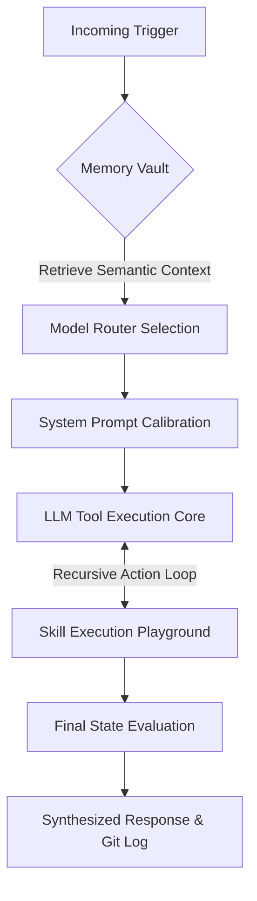

<div align="center">
  <h1>🤖 OpenClaw Echo</h1>
  <p><b>A Production-Ready, Self-Evolving, Autonomous AI Agent Framework</b></p>

  []()
  []()
  []()
  []()
  []()
  []()
</div>

<br>

OpenClaw Echo is a massively capable, self-orchestrating AI layer. Unlike standard reactive chatbots, Echo exists as an independent entity capable of maintaining persistent memory, scheduling its own background tasks, analyzing massive codebases, synthesizing data into charts, and automatically pushing updates to its own version control.

---

## 🚀 Key Framework Pillars

* **Hybrid Intelligence (`ModelRouter`)**: Seamlessly fail-over between Google Gemini 1.5 Flash (Cloud, API v1) and Ollama Llama 3 (Local Edge). Includes smart retry logic for 429/503 errors and instant failover on 404 misconfigurations.
* **Graceful Lifecycle Management**: Professional `SIGINT`/`SIGTERM` handlers ensure clean shutdown of Express, Telegram Bot, and SQLite. Automatic port conflict resolution with fallback to port 3006.
* **The Swarm (Delegation Strategy)**: The primary Manager agent can spawn asynchronous sub-agents (`Researcher`, `Coder`, `Analyst`, `Writer`) to execute gigantic monolithic tasks in parallel.
* **The Diplomat (Communication)**: Full NodeMailer SMTP integration, allowing the agent to dispatch rich HTML emails and system reports to human operators autonomously.
* **The Clockwork (Scheduling)**: Granular Cron functionality. The agent can set `setInterval` logic to autonomously perform audits, web sweeps, and summary dispatches without user prompts.
* **The Engineer (Git Ops)**: Integrated `simple-git` bindings. The agent can evaluate its workspace, compose semantic commit messages, and push directly to GitHub.
* **Real-time Telemetry (SSE Command Center)**: A breathtaking web dashboard located at `http://localhost:3005` that leverages Server-Sent Events to push 0-latency logs, health maps, and network topology graphics.

---

## 🧠 Autonomous 6-Step Neural Flow

OpenClaw Echo governs its logic loops through a strict, deterministic processing funnel:



---

## 🛠️ The Autonomous Tool Matrix (18 Registered Skills)

| Sub-System | Core Capabilities |
| :--- | :--- |
| **🌐 The Explorer** | Deep Web Scraper (`cheerio`/Tavily), Web Searching. |
| **📁 The Architect** | Local File Reader/Writer, File Editor, Directory Analyzer. |
| **🧠 The Scholar** | Vector RAG Ingestion, Semantic Memory Retrieval, JSON Persistent Context. |
| **📊 The Analyst** | HTML/SVG DOM Chart Generation, System Metric Auditing (`The Sentinel`). |
| **🎯 The Oracle** | Long-Term Goal Management, Task Breakdown tracking. |
| **⚙️ The Engine** | Execute `sandbox/` Node scripts, Dynamic Framework Extension (can write code to teach itself new skills instantly). |
| **📧 The Diplomat** | Autonomous HTML email dispatch via SMTP. |
| **⏰ The Clockwork** | Persistent scheduled task management with interval-based automation. |
| **🔧 The Engineer** | Git status, commit, and push operations via `simple-git`. |

---

## 💻 Installation & Setup

### 1. Bare Metal Operation (Node.js)
```bash
# Clone the repository
git clone https://github.com/your-username/open-claw-echo.git
cd open-claw-echo

# Install standard dependencies
npm install

# Build environment configuration
cp .env.example .env
# Edit .env and supply GOOGLE_API_KEY, TELEGRAM_TOKEN, SMTP_USER, etc.

# Boot Agent & Telemetry Server
npm start
```

### 2. Containerized Operation (Docker Compose)
OpenClaw Echo includes a production-ready Docker stack with a dedicated Ollama container for local AI inference.

```bash
# Start the full stack (Echo + Ollama) in detached mode
docker-compose up -d --build

# Pull llama3 into the Ollama container (first time only)
docker exec openclaw-ollama ollama pull llama3

# View Agent logs
docker-compose logs -f open-claw-echo
```

### 3. Environment Variables

| Variable | Required | Description |
| :--- | :--- | :--- |
| `GOOGLE_API_KEY` | ✅ | Google Gemini API key |
| `TELEGRAM_TOKEN` | ✅ | Telegram Bot token from @BotFather |
| `OLLAMA_BASE_URL` | ❌ | Ollama endpoint (default: `http://localhost:11434`) |
| `OLLAMA_MODEL` | ❌ | Local model name (default: `llama3`) |
| `PORT` | ❌ | Dashboard port (default: `3005`) |
| `SMTP_HOST` | ❌ | SMTP server for email dispatch |
| `SMTP_PORT` | ❌ | SMTP port (default: `587`) |
| `SMTP_USER` | ❌ | SMTP username |
| `SMTP_PASS` | ❌ | SMTP app password |

---

## 📡 Live Telemetry Command Center

Once booted, point your browser to **[http://localhost:3005](http://localhost:3005)** to enter the Live Diagnostic Hub.

**Dashboard Features:**
1. **Neural Connectivity Graph**: Real-time status of Gemini, Ollama, SQLite, and Vector Core.
2. **Sentinel Audit Engine**: Full system health check with a 0-100% security score.
3. **Clockwork Modules**: View all timers and Cron jobs the agent is currently looping in the background.
4. **Live Sandbox Logs**: SSE handles direct streaming from the LangChain LLM evaluation buffer straight into your DOM.
5. **Visual Insights Viewer**: Direct rendering of the autonomous SVG files the agent drafts.
6. **Personality Switcher**: Switch between Standard, Creative, and Analytical agent personas.

---

## 🏗️ Architecture

```
src/
├── index.ts                 # Bootstrap + Graceful Shutdown (SIGINT/SIGTERM)
├── core/
│   ├── router.ts            # Hybrid ModelRouter (Gemini v1 + Ollama fallback)
│   ├── analyzer.ts          # Self-reflection & Mermaid architecture diagrams
│   ├── logger.ts            # In-memory dashboard logger
│   ├── telemetry.ts         # Real-time SSE broadcast engine
│   ├── personalities.ts     # Dynamic persona system
│   ├── goals.ts             # Long-term goal persistence (Oracle)
│   ├── clockwork.ts         # Persistent task scheduler
│   ├── diplomat.ts          # SMTP email engine
│   ├── engineer.ts          # Git version control integration
│   ├── scraper.ts           # Web content extraction
│   ├── swarm.ts             # Multi-agent delegation
│   └── visualizer.ts        # SVG chart generation
├── memory/
│   ├── manager.ts           # SQLite + Vector Core (RAG)
│   └── semantic_core.json   # Persistent vector embeddings
├── skills/
│   ├── tools.ts             # 18 registered autonomous tools
│   ├── registry.ts          # Centralized skill hub
│   └── dynamic/             # Runtime-synthesized skills
├── integrations/
│   ├── telegram.ts          # Express server + Telegram bot + Dashboard APIs
│   └── dashboard.html       # Live diagnostic web UI
└── sandbox/                 # Isolated execution environment
```

<br>

<div align="center">
<i>"Intelligence is not just knowledge, but the autonomy to apply it safely across the open layer."</i>
</div>
