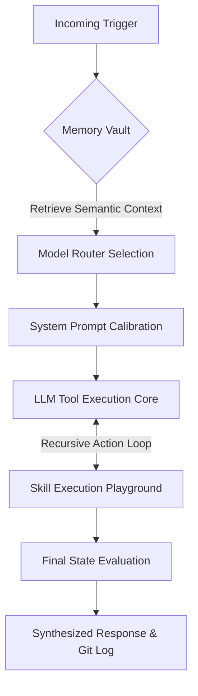

<div align="center">
  <h1>🤖 OpenClaw Echo</h1>
  <p><b>A Production-Ready, Self-Evolving, Autonomous AI Agent Framework</b></p>

  []()
  []()
  []()
  []()
  []()
</div>

<br>

OpenClaw Echo is a massively capable, self-orchestrating AI layer. Unlike standard reactive chatbots, Echo exists as an independent entity capable of maintaining persistent memory, scheduling its own background tasks, analyzing massive codebases, synthesizing data into charts, and automatically pushing updates to its own version control.

---

## 🚀 Key Framework Pillars

* **Hybrid Intelligence (`ModelRouter`)**: Seamlessly fail-over between Google Gemini (Cloud) and Ollama Llama 3 (Local Edge).
* **The Swarm (Delegation Strategy)**: The primary Manager agent can spawn asynchronous sub-agents (`Researcher`, `Coder`, `Analyst`, `Writer`) to execute gigantic monolithic tasks in parallel.
* **The Diplomat (Communication)**: Full NodeMailer SMTP integration, allowing the agent to dispatch rich HTML emails and system reports to human operators autonomously.
* **The Clockwork (Scheduling)**: Granular Cron functionality. The agent can set `setInterval` logic to autonomously perform audits, web sweeps, and summary dispatches without user prompts.
* **The Engineer (Git Ops)**: Integrated `simple-git` bindings. The agent can evaluate its workspace, compose semantic commit messages, and push directly to GitHub.
* **Real-time Telemetry (SSE Command Center)**: A breathtaking web dashboard located at `http://localhost:3005` that leverages Server-Sent Events to push 0-latency logs, health maps, and network topology graphics.

---

## 🧠 Autonomous 6-Step Neural Flow

OpenClaw Echo governs its logic loops through a strict, deterministic processing funnel:



---

## 🛠️ The Autonomous Tool Matrix (25+ Tools)

| Sub-System | Core Capabilities |
| :--- | :--- |
| **🌐 The Explorer** | Deep Web Scraper (`cheerio`/Tavily), Web Searching. |
| **📁 The Architect** | Local File Reader/Writer, File Editor, Directory Analyzer. |
| **🧠 The Scholar** | Vector RAG Ingestion (`ChromaDB`), Semantic Memory Retrieval, JSON Persistent Context. |
| **📊 The Analyst** | HTML/SVG DOM Chart Generation, System Metric Auditing (`The Sentinel`). |
| **🎯 The Oracle** | Long-Term Goal Management, Task Breakdown tracking. |
| **⚙️ The Engine** | Execute `sandbox/` Node scripts, Dynamic Framework Extension (can write code to teach itself new skills instantly). |

---

## 💻 Installation & Setup

### 1. Bare Metal Operation (Node.js)
```bash
# Clone the repository
git clone https://github.com/your-username/open-claw-echo.git
cd open-claw-echo

# Install standard dependencies
npm install

# Build environment configuration
cp .env.example .env
# Edit .env and supply GOOGLE_API_KEY, TELEGRAM_TOKEN, SMTP_USER, etc.

# Boot Agent & Telemetry Server
npm start
```

### 2. Containerized Operation (Docker Compose)
OpenClaw Echo shines in isolated environments. The `docker-compose.yml` mounts the sandbox and skills directory for safe evaluation.

```bash
# Start the Echo stack in detached mode
docker-compose up -d --build

# View Agent logs
docker-compose logs -f open_claw_echo
```

---

## 📡 Live Telemetry Command Center

Once booted, point your browser to **[http://localhost:3005](http://localhost:3005)** to enter the Live Diagnostic Hub.

**Dashboard Features:**
1. **Neural Connectivity Graph**: See instant ping statuses to SQLite, ChromaDB, and your Language Models.
2. **Clockwork Modules**: View all timers and Cron jobs the agent is currently looping in the background.
3. **Live Sandbox Logs**: SSE handles direct streaming from the LangChain LLM evaluation buffer straight into your DOM.
4. **Visual Insights Viewer**: Direct rendering of the autonomous SVG files the agent drafts.

<br>

<div align="center">
<i>"Intelligence is not just knowledge, but the autonomy to apply it safely across the open layer."</i>
</div>
