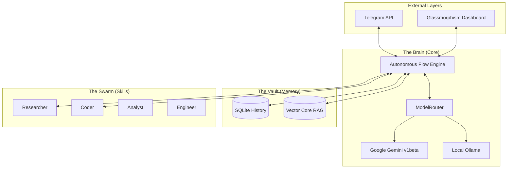

<div align="center">
  <h1>🤖 OpenClaw Echo</h1>
  <p><b>A Production-Ready, Self-Evolving, Autonomous AI Agent Framework on Telegram</b></p>

  []()
  []()
  []()
  []()
  []()
  []()
</div>

<br>

## 📖 Short Description

**OpenClaw Echo** is a massively capable, self-orchestrating AI layer and Telegram bot. Unlike standard reactive chatbots, Echo exists as an independent entity capable of maintaining persistent memory, scheduling its own background tasks, analyzing massive codebases, synthesizing data into charts, and automatically pushing updates to its own version control. It runs on a hybrid intelligence model, dynamically failing over between the state-of-the-art **Google Gemini 2.0 Flash** and local **Ollama** edge nodes via a Singleton-protected service layer.

---

## ✨ Features List

* **Hybrid Intelligence (`ModelRouter`)**: Seamlessly routes between **Google Gemini 2.0 Flash** (Cloud API v1beta) and **Ollama Llama 3** (Local Edge). Includes a **40-second stability timeout** and Singleton-protected handshake logic.
* **Autonomous 6-Step Neural Flow**: Extracts context, trims history, invokes intelligence, executes tools, replies, and persists data entirely autonomously.
* **The Swarm (Delegation Strategy)**: Spawns asynchronous sub-agents (`Researcher`, `Coder`, `Analyst`, `Writer`, `QA_Engineer`) to execute gigantic monolithic tasks in parallel.
* **Persistent Memory & Vector RAG**: Maintains a rolling SQLite history and a serverless JSON Vector Core for long-term semantic retrieval.
* **Dynamic Skill Registry**: Features 18+ registered autonomous tools including Deep Web Scraping, SMTP Email Dispatch, Git version control, and Sandbox Code Execution.
* **Unified Real-time Dashboard**: A breathtaking glassmorphic dashboard served directly from the backend on a single port (3005), simplifying deployment and reducing latency.
* **The Clockwork Scheduler**: Persistent, autonomous background task engine that allows the agent to schedule its own technical research, code audits, or notifications.
* **Polling & Webhook Support**: Flexible Telegram integration with automatic message chunking for 4000+ character responses.

---

## 🛠️ Tech Stack

* **Core Runtime:** Node.js, TypeScript
* **AI Orchestration:** LangChain, Google Generative AI SDK `@google/generative-ai`
* **Local Inference:** Ollama 
* **Database / Memory:** SQLite3 (`sqlite3`), Chroma/JSON Vector Core
* **Web & Dashboard:** Express.js, Server-Sent Events (SSE), Mermaid.js
* **Integrations:** `node-telegram-bot-api`, `simple-git`, `nodemailer`, `cheerio`

---

## 🏗️ Neural Architecture



---

## 🔄 The 6-Step Autonomous Cycle

Every interaction with OpenClaw Echo triggers a sophisticated neural cycle:

1.  **Ingestion:** Extracts raw text, images, or metadata from Telegram/Web.
2.  **Synthesis:** Retrieves semantic context from Vector Core and recent history from SQLite.
3.  **Routing:** Calculates the optimal model (Gemini vs Ollama) based on task complexity and quota limits.
4.  **Devolve:** Spawns specialized sub-agents from **The Swarm** to handle specific technical sub-tasks.
5.  **Execution:** Invokes 18+ registered tools (Sandbox, Git, Web, Email) in a recursive loop.
6.  **Persistence:** Summarizes the interaction, updates the user profile, and commits to long-term memory.

---

## 🏗️ Project Structure

```text
open-claw-echo/
├── src/
│   ├── core/           # The Brain: Swarm logic, Model Routing, Timers, Goals
│   ├── memory/         # The Vault: Semantic memory, SQLite manager, RAG
│   ├── skills/         # The Tools: Custom tools (Web search, Git ops, File parsing)
│   ├── integrations/   # The Bridge: Telegram Bot, Express API, Dashboard SSE
│   ├── sandbox/        # Isolated folder for safe execution of AI-generated node apps
│   └── index.ts        # Bootstrap, graceful shutdown (SIGINT/SIGTERM), Port cleanup
├── scratch/            # Temporary diagnostic testing scripts
├── docker-compose.yml  # Production Docker stack (Agent + Ollama sidecar)
├── Dockerfile          # Production container setup
├── openclaw.db         # Persistent SQLite database (auto-generated)
├── package.json        # Dependencies and build scripts
└── .env                # Environment variables (API Keys and Config)
```

---

## 💻 Installation Steps

### Option A: Bare Metal (Node.js)

1. **Clone the repository**
   ```bash
   git clone https://github.com/roqaiahanjum/openclaw-echo.git
   cd openclaw-echo
   ```

2. **Install dependencies**
   ```bash
   npm install
   ```

3. **Configure Environment**
   ```bash
   cp .env.example .env
   # Edit .env and supply your GOOGLE_API_KEY and TELEGRAM_TOKEN
   ```

4. **Boot Agent & Unified Dashboard**
   ```bash
   npm start
   ```
   Open **[http://localhost:3005](http://localhost:3005)** to enter the Live Diagnostic Hub.

### Option B: Containerized (Docker Compose)
*Highly recommended for maximum sandbox isolation.*

1. **Start the Echo stack in detached mode**
   ```bash
   docker-compose up -d --build
   ```

2. **Pull the local fallback model (First time only)**
   ```bash
   docker exec openclaw-ollama ollama pull llama3
   ```

---

## 🔐 Environment Variables

Create a `.env` file in the root directory.

| Variable | Required | Description |
| :--- | :--- | :--- |
| `GOOGLE_API_KEY` | ✅ | Google Gemini API key |
| `TELEGRAM_TOKEN` | ✅ | Telegram Bot token from @BotFather |
| `OLLAMA_BASE_URL` | ❌ | Ollama endpoint (default: `http://localhost:11434` / `http://ollama:11434`) |
| `OLLAMA_MODEL` | ❌ | Local model name (default: `llama3:latest`) |
| `PORT` | ❌ | Dashboard port (default: `3005`) |
| `SMTP_HOST` | ❌ | SMTP server for email dispatch (`setup for notification agent`) |
| `SMTP_PORT` | ❌ | SMTP port (default: `587`) |
| `SMTP_USER` | ❌ | SMTP username |
| `SMTP_PASS` | ❌ | SMTP app password |

---

## 🚀 How to Run

### Launch Command
```bash
# Cleans up ports, installs/builds the dashboard if missing, and boots the unified server
npm start
```
Open **[http://localhost:3005](http://localhost:3005)** to enter the Live Diagnostic Hub. (The Dashboard is now served directly from the same port as the API!)

---

## 📱 How to Use on Telegram

1. Open Telegram and search for your bot username (the one you created with `@BotFather`).
2. Click **Start** or send `/status`.
3. Talk to it naturally! 
   - *"Research the latest AI news and summarize it."*
   - *"Check your sandbox directory and write a python script that prints 'Hello'."*
   - *"Delegate a task to the QA_Engineer to review my code."*
4. Long responses exceeding the 4096-character limit will be intelligently and automatically chunked!

---

## 🎭 Persona Deep-Dive

| Persona | Technical Focus | Primary Toolset | Rationale |
| :--- | :--- | :--- | :--- |
| **Elite Researcher** | High-entropy data synthesis | `cheerio`, `google-search` | Designed for deep web analysis and fact-checking. |
| **System Architect** | Structural UML & Design | `mermaid.js`, `file-system` | Focuses on codebase visualization and architecture. |
| **Code Engineer** | Efficiency & Debugging | `sandbox-exec`, `simple-git` | Specialized in writing, testing, and committing code. |
| **Neural Synthesis** | Cross-domain creative logic | `vector-rag`, `memory-vault` | Best for semantic retrieval and context stitching. |

---

## 🛡️ Sentinel Audit: The Integrity Layer
The Sentinel Audit isn't just a dashboard button; it's a diagnostic middleware that:
1. **Validates State:** Ensures the `ModelRouter` hasn't hung during a failover.
2. **Prunes Context:** Automatically triggers a "trim" if the SQLite history exceeds the LLM's token window (preventing Error 400).
3. **Security Handshake:** Checks if the `.env` variables are correctly loaded before allowing the agent to execute "Write" commands.

## 💡 Design Decisions
- **Why Hybrid?** To balance the high reasoning of Gemini with the 100% privacy and zero-cost of local Ollama models.
- **Why Telegram?** To provide a zero-install mobile interface for an autonomous system.
- **Why SQLite?** For a serverless, "Zero-Config" persistent memory that travels with the repository.
---

## ⚖️ License

Distributed under the MIT License. See `LICENSE` for more information.

<br>

<div align="center">
<i>"Intelligence is not just knowledge, but the autonomy to apply it safely across the open layer."</i>
</div>