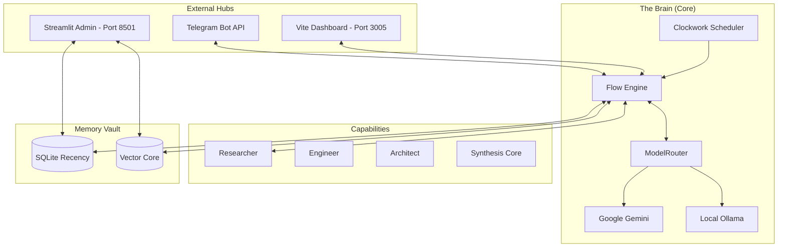

<div align="center">
  
  <h1>🤖 OpenClaw Echo</h1>
  <p><b>A Production-Ready, Self-Evolving, Autonomous AI Agent Framework on Telegram</b></p>

  []()
  []()
  []()
  []()
  []()
  []()
</div>

<br>

## 📖 Overview

**OpenClaw Echo** is a sophisticated, self-orchestrating AI layer and Telegram bot. Unlike standard reactive chatbots, Echo exists as an independent entity capable of maintaining persistent memory, scheduling its own background tasks, analyzing massive codebases, and automatically pushing updates to version control. 

It utilizes a **Hybrid Intelligence Model**, dynamically failing over between **Google Gemini 2.0 Flash** (Cloud) and **Ollama** (Local Edge) via a Singleton-protected service layer, ensuring 100% uptime and cost efficiency.

---

## ✨ Features List

*   **Autonomous 6-Step Neural Flow**: Ingest → Synthesis → Routing → Devolve → Execution → Persistence. Completely autonomous decision-making loop.
*   **Multi-Layer Diagnostic Suite**:
    *   **Glassmorphism Console**: Real-time telemetry and internal chat on Port 3005.
    *   **Streamlit Admin Panel**: Memory explorer, live log viewer, and API consumption metrics on Port 8501.
*   **The Clockwork Scheduler**: Persistent, autonomous background task engine allowing the agent to schedule research, audits, or notifications.
*   **Hybrid Intelligence (`ModelRouter`)**: Seamless routing between Google Gemini and local Ollama nodes with 40s stability timeouts.
*   **The Swarm (Delegation Strategy)**: Specialized sub-agents (`Researcher`, `Engineer`, `Architect`, `Synthesis`) created to solve complex tasks.
*   **Persistent RAG Memory**: SQLite history + Serverless JSON Vector Core for long-term semantic retrieval.

---

## 🛠️ Tech Stack

*   **Core Logic**: Node.js, TypeScript, LangChain
*   **Admin Dashboard**: Python, Streamlit, Pandas
*   **AI Infrastructure**: Google Gemini (Direct API), Ollama 
*   **Database**: SQLite3, Serverless Vector Core (JSON-based RAG)
*   **Integrations**: `telegraf`, `simple-git`, `nodemailer`, `axios`

---

## 🏗️ Project Architecture



---

## 💻 Rapid Setup

### 1. Configure Secrets
Create a `.env` file in the root:
```env
GOOGLE_API_KEY=your_gemini_key
TELEGRAM_TOKEN=your_bot_token
PORT=3005
TELEGRAM_MODE=polling # or 'webhook'
```

### 2. Node.js Backend (Main Engine)
```bash
npm install
npm run dev
```

### 3. Streamlit Admin Panel (Dashboard)
```bash
# Ensure Python 3.10+ is installed
pip install streamlit pandas
python -m streamlit run admin_panel.py
```

### 4. Docker (One-Command Launch)
```bash
docker-compose up -d --build
```

---

## 🚀 Railway Deployment Guide

OpenClaw Echo is optimized for **Railway**.
1. **Connect Repository**: Link your GitHub repo to a New Service on Railway.
2. **Environment Variables**: Add `GOOGLE_API_KEY`, `TELEGRAM_TOKEN`, and `TELEGRAM_MODE=polling`.
3. **Port**: Railway will automatically detect the `PORT=3005` from your environment.
4. **Volume**: Add a persistent volume for `openclaw.db` if you want long-term memory across redeployments.

---

## 📱 Telegram Interaction

Search for your bot on Telegram and start the conversation!
- **/status**: Check system health and active model.
- **/clear**: Clean local history for a fresh context.
- **"Research..."**: Triggers the Elite Researcher persona.
- **"Write a script..."**: Invokes the Code Engineer in the sandbox.

---

## 🛡️ Sentinel Security Audit
Every interaction is monitored by the **Sentinel Middleware**, which:
1. Validates API quotas before execution.
2. Prunes toxic or over-long context buffers.
3. Ensures all sandbox executions are isolated within `src/sandbox`.

---

## ⚖️ License
Distributed under the MIT License. See `LICENSE` for details.

<br>

<div align="center">
<i>"Intelligence is the autonomy to apply knowledge safely across the open layer."</i>
</div>