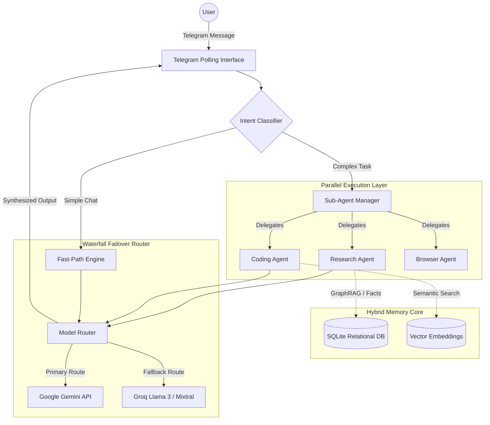

# OpenClaw Echo: Final Project Report

## 1. Abstract
OpenClaw Echo is a local-first, production-grade autonomous AI agent framework designed to solve the common pitfalls of traditional Large Language Model (LLM) wrappers—namely context exhaustion, API rate-limit crashes, and linear task execution. The system features a native Telegram interface, parallel sub-agent delegation, a 5-layer hybrid memory architecture (including GraphRAG and semantic vectors), and a highly resilient Waterfall Failover Router that ensures zero-downtime operation.

## 2. Introduction
As LLMs become integral to daily workflows, the reliance on single-provider APIs (like OpenAI or Google) creates a single point of failure. Furthermore, agents typically execute tasks sequentially and lose long-term context. OpenClaw Echo addresses these issues by:
1. **Parallelizing workloads** using specialized sub-agents.
2. **Persisting knowledge** permanently via SQLite and Vector databases.
3. **Healing network failures** instantly by routing failed requests to fallback open-source models hosted on Groq.

## 3. System Architecture

The architecture follows a modular, event-driven design:

## 4. Key Components & Implementation

### 4.1 Telegram Interface & Fast-Path Engine
The system utilizes the `Telegraf` library to establish a persistent connection with users. To optimize API usage, an Intent Classifier scans incoming messages. If a query is identified as a simple greeting or a direct search request, it triggers the **Fast-Path Engine**, bypassing the complex multi-agent planner and saving significant token costs.

### 4.2 Sub-Agent Swarm (Concurrency)
Traditional agents plan and execute steps one by one. OpenClaw Echo's `SubAgentManager` implements asynchronous parallel execution. Using Node.js `Promise.all()`, the main orchestrator can dispatch simultaneous tasks to:
- **Research Agent:** Scrapes and summarizes web content.
- **Coding Agent:** Writes, reviews, and executes code.
- **Browser Agent:** Handles deep web navigation.

### 4.3 5-Layer Hybrid Memory System
To overcome context window limitations, the system relies on a tiered memory approach:
1. **Short-term Context:** Recent conversational turns kept in memory.
2. **Summarized Context:** Periodic summarization of past interactions.
3. **Semantic Vector Search:** LangChain's MemoryVectorStore maps document embeddings to `semantic_core.json` for fuzzy searching.
4. **Relational Fact Storage:** Explicit facts (user name, preferences, college) are extracted via Regex and stored deduplicated in a local SQLite database (`openclaw.db`).
5. **GraphRAG (Knowledge Graph):** A triple-store implementation (`KnowledgeGraphManager`) extracts Entity-Predicate-Entity relationships and allows multi-hop subgraph traversals to answer complex relational queries.

### 4.4 Waterfall Failover Router (Circuit Breaker)
The `ModelRouter` class guarantees uptime. All LLM requests flow through this router. It attempts to resolve queries using `Gemini 2.5 Flash` first. If Google's API returns a `429 Too Many Requests` or times out after 30 seconds, the router's Circuit Breaker trips. It immediately re-formats the prompt and falls back to `Groq Llama 3.1 8B`, degrading gracefully without interrupting the user's Telegram session.

## 5. Technology Stack
- **Languages:** TypeScript, Node.js (v20+)
- **AI / LLMs:** LangChain Core, Google Generative AI API, Groq SDK
- **Databases:** SQLite3 (Relational & Graph), LangChain MemoryVectorStore (Semantic)
- **UI / Integration:** Telegram Bot API (`telegraf`), Express.js

## 6. Limitations & Future Enhancements
While highly resilient, OpenClaw Echo relies heavily on cloud APIs (Gemini/Groq). 
**Future Roadmap:**
1. **Local LLM Execution:** Integrating `Ollama` to run quantized models (e.g., Llama 3 8B) entirely locally on consumer hardware.
2. **Autonomous Background Cron:** Allowing the agent to wake up, research topics, and push notifications to Telegram without a user trigger.

## 7. Conclusion
OpenClaw Echo successfully demonstrates that AI agents can be made enterprise-ready by applying standard distributed system principles—parallelism, state persistence, and circuit-breaking—to LLM orchestrations. It provides a robust, zero-downtime assistant capable of handling deep context and multi-step reasoning.
